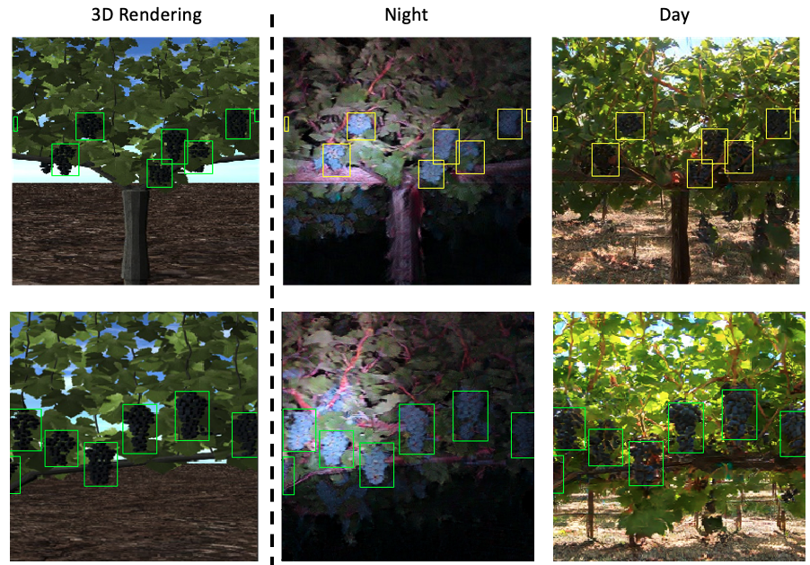

# Enlisting 3D Crop Models and GANs for More Data Efficient and Generalizable Fruit Detection

We provide the pytorch implementation of a semantically constrained GAN to generate artificial realisitc fruit images for training to reduce the need of real image labeling in fruit detection.

**[Paper Link](https://openaccess.thecvf.com/content/ICCV2021W/CVPPA/papers/Fei_Enlisting_3D_Crop_Models_and_GANs_for_More_Data_Efficient_ICCVW_2021_paper.pdf)**



## **1. Install Requirements**  
```
pip install -r requirements.txt
```
## **2. Generate Semantic Consistent GAN Fruits**
Use [generateGANImages.ipynb](notebook/generateGANImages.ipynb) notebook to load the pre-trained Semantic Consistent GAN model and generate target domain images from source synthetic image.

## **3. Prepare Data**

### Source domain data  
The dataset used in this research:
1. Synthetic Grape Data

### Target domain data
The dataset used in this research:
1. Night Grape
2. Day Grape


